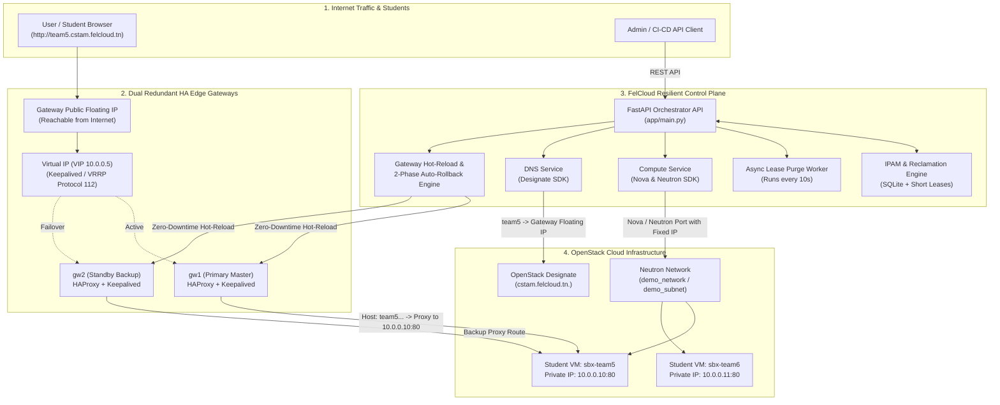
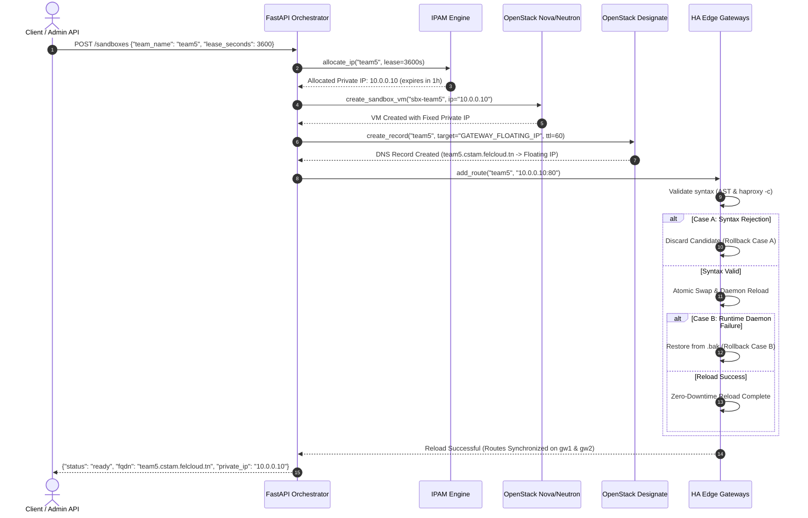

# System Architecture & OpenStack HA Gateway Data Flow

## 📌 Project: FelCloud Resilient IP Optimizer (CSTAM-FELCLOUD)
### **Phase 1: Core Functionalities MVP (50 Points)**

---

## 1. Global System Architecture

---

## 2. End-to-End Data Flow: Sandbox Auto-Provisioning

---

## 3. High Availability & Failover Breakdown

1. **Floating IP & VRRP Allowed-Address-Pairs**:
   - The Public Floating IP forwards all web traffic to the internal Virtual IP (VIP `10.0.0.5`).
   - OpenStack Neutron port security allows VIP packets via `allowed-address-pairs` on `gw1` and `gw2`.
   - Security Group explicitly permits IP Protocol 112 (VRRP).
2. **Two-Phase Auto-Rollback Engine**:
   - **Case A (Pre-reload Rejection)**: Invalid syntax / IP / Port caught before reload. Candidate discarded, 0ms downtime.
   - **Case B (Post-reload Recovery)**: Runtime failure triggers active restoration of `/etc/haproxy/haproxy.cfg.bak`.
3. **Automated IPAM & Continuous Reclamation**:
   - Asynchronous background worker scans the database every 10 seconds.
   - Any expired lease immediately deletes the associated VM, clears the DNS record, updates the Gateways, and frees the IP address for new teams.
