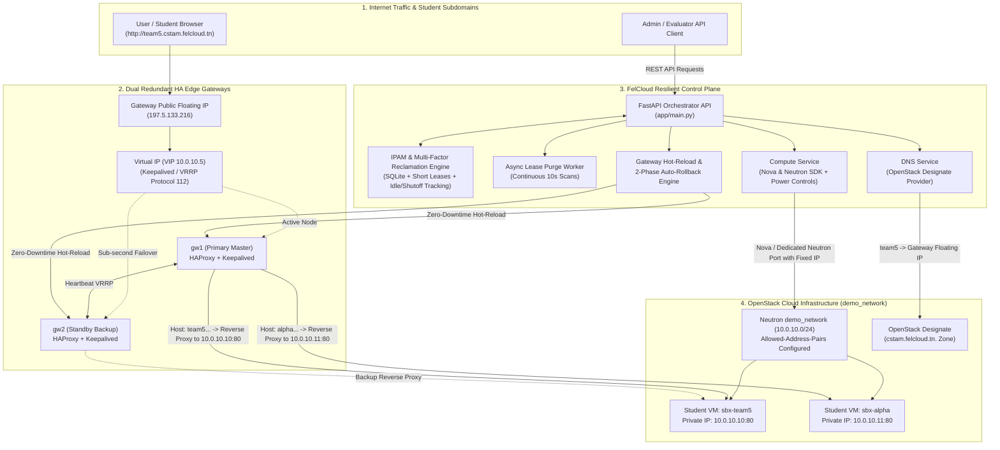
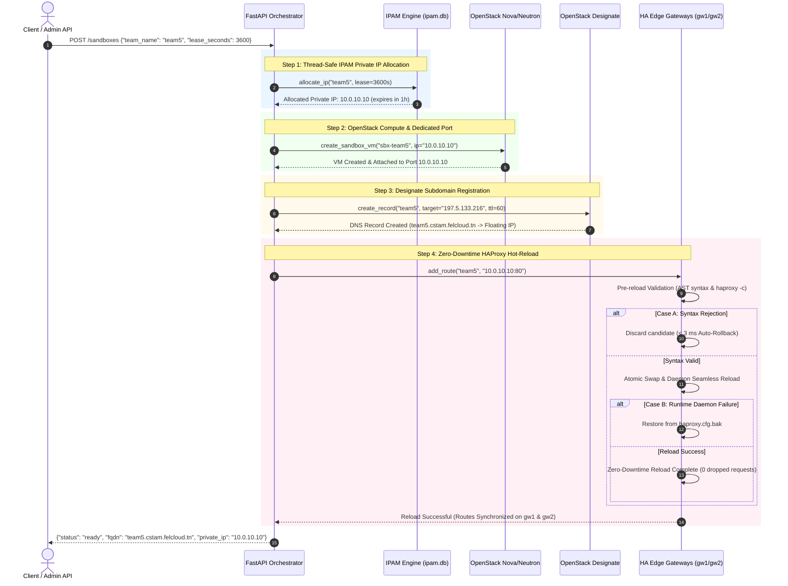
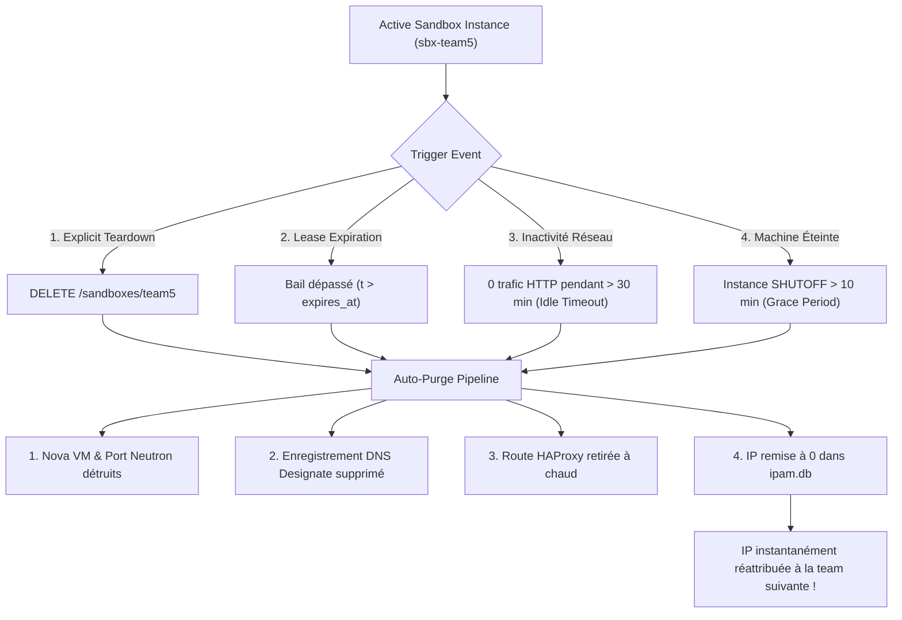

# System Architecture & OpenStack HA Gateway Data Flow

## 📌 Project: FelCloud Resilient IP Optimizer (CSTAM-FELCLOUD)
### **Phase 1: Core Functionalities MVP (50 Points Submission Document)**

---

## 1. Global System Architecture

---

## 2. End-to-End Data Flow: Sandbox Auto-Provisioning

---

## 3. Multi-Factor Reclamation & IP Recycling Flow

The IPAM and Sandbox engine purges and recycles an IP address upon any of the following events:

---

## 4. High Availability & Failover Technical Breakdown

1. **Floating IP & VRRP Allowed-Address-Pairs**:
   - The Public Floating IP (`197.5.133.216`) forwards all incoming web traffic to the internal Virtual IP (VIP `10.0.10.5`).
   - OpenStack Neutron port security allows VIP packets via `allowed-address-pairs` on `gw1` and `gw2`.
   - Security Group explicitly permits **IP Protocol 112 (VRRP)**.
2. **Two-Phase Auto-Rollback Engine**:
   - **Case A (Pre-reload Rejection)**: Invalid syntax / IP / Port caught before reload. Candidate discarded in **< 3 ms** with 0ms downtime.
   - **Case B (Post-reload Recovery)**: Runtime failure triggers active restoration of `/etc/haproxy/haproxy.cfg.bak`.
3. **Automated IPAM & Continuous Reclamation**:
   - Asynchronous background worker scans the database every 10 seconds.
   - Reclaims expired leases, idle sandboxes, and abandoned shutoff VMs, freeing IPv4 addresses for new teams.
