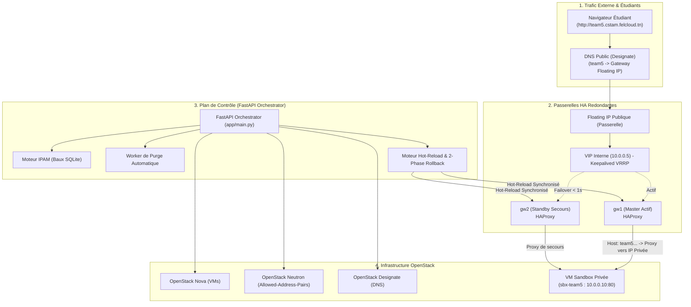

# 🚀 FelCloud Resilient IP Optimizer & Sandbox Orchestrator
### **CSTAM-FELCLOUD Challenge — Phase 1: Core Functionalities MVP**

---

## 📌 Présentation du Projet
**FelCloud Resilient IP Optimizer** est un orchestrateur cloud intelligent conçu pour les hackathons et environnements étudiants haute densité sur **OpenStack**. Il résout la pénurie d'adresses IPv4 et élimine les points uniques de défaillance (SPOF) grâce à :
1. **L'Auto-Provisioning de Sandboxes** : Création automatisée de VMs OpenStack (Nova/Neutron) avec IP privée dédiée.
2. **Des Passerelles Haute Disponibilité (Dual HA Gateways)** : Routage de bordure Keepalived (VRRP) + HAProxy avec basculement transparent.
3. **Un Moteur IPAM & Recyclage Automatique** : Baux courts temporaires et purge automatique des IPs expirées via un worker asynchrone.
4. **Zero-Downtime Hot-Reload & Auto-Rollback en 2 Phases** : Rechargement des règles de routage avec validation syntaxique/sémantique et rollback instantané sans coupure de trafic.

---

## 🏛️ Architecture & Flux de Données



---

## 🛠️ Installation & Démarrage

### 1. Prérequis
* Python 3.10+
* OpenStack CLI / Accès API Keystone

### 2. Installation des dépendances
```bash
python -m venv venv
# Windows :
.\venv\Scripts\activate
# Linux/macOS :
source venv/bin/activate

pip install -r requirements.txt
```

### 3. Configuration de l'environnement
Copiez le modèle de configuration et renseignez vos identifiants :
```bash
cp .env.example .env
```

### 4. Démarrage de l'API en Production / Démo
```bash
uvicorn app.main:app --host 0.0.0.0 --port 8000
```
> L'interface Swagger interactive est disponible sur : `http://localhost:8000/docs`

---

## 🧪 Validation & Démonstration devant le Jury

### A. Configuration OpenStack VRRP & VIP
Pour configurer les `allowed-address-pairs` sur Neutron et autoriser le protocole VRRP (112) :
```bash
python setup_openstack_vrrp.py
```

### B. Preuve du Zero-Downtime Rollback avec trafic continu
Envoie 50 requêtes HTTP/seconde et injecte une configuration corrompue en plein vol pour prouver 100% de requêtes réussies :
```bash
python verify_rollback_zero_downtime.py
```

### C. Exécution du Benchmark Complet (Métriques décomposées)
Chronomètre en millisecondes le provisioning, l'auto-rollback et le recyclage d'IP :
```bash
python live_benchmark_demo.py
```

### D. Exécution des Tests Automatisés
```bash
pytest tests/ -v
```

---

## 📁 Structure du Projet

```text
felcloud-dns/
├── app/
│   ├── main.py                     # API FastAPI + Worker de purge asynchrone
│   ├── api/                        # Routes REST (sandboxes, gateways, ipam, dns)
│   └── services/                   # Logique métier (compute, gateway, ipam, sandbox)
├── deploy/ha_gateways/             # Scripts et configurations Keepalived / HAProxy
├── tests/                          # Suite de tests unitaires et d'intégration
├── setup_openstack_vrrp.py         # Configuration Neutron VIP & VRRP
├── verify_rollback_zero_downtime.py# Preuve continue de Zero-Downtime Rollback
├── live_benchmark_demo.py          # Benchmark réel chiffré en ms
├── DEMO_VIDEO_GUIDE.md             # Guide d'enregistrement de la vidéo jury (2-3 min)
├── ARCHITECTURE_PHASE1.md          # Rapport d'architecture et de flux
├── .env.example                    # Modèle des variables d'environnement
├── .gitignore                      # Protection des secrets et fichiers temporaires
└── requirements.txt                # Dépendances Python
```
