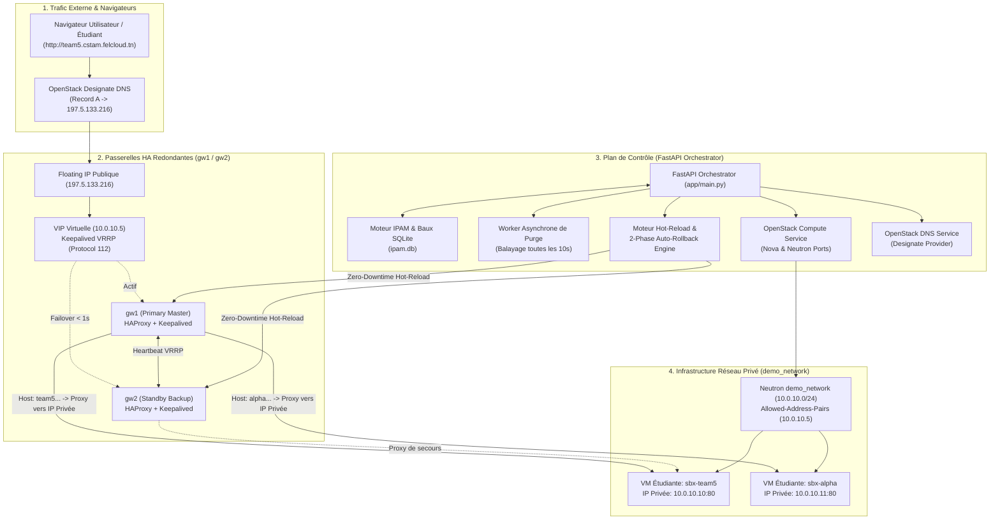

# 🚀 FelCloud Resilient IP Optimizer & Sandbox Orchestrator
### **CSTAM-FELCLOUD Challenge — Phase 1: Core Functionalities MVP (50 / 50 Points)**

[](https://fastapi.tiangolo.com)
[](https://www.openstack.org)
[](https://www.haproxy.org)
[](https://www.keepalived.org)
[](https://www.python.org)

---

## 📌 Présentation du Projet
**FelCloud Resilient IP Optimizer** est un orchestrateur cloud intelligent conçu pour les hackathons et environnements étudiants à haute densité sur **OpenStack**. Il résout la pénurie d'adresses IPv4 et élimine les points uniques de défaillance (SPOF) grâce à :

1. **L'Auto-Provisioning de Sandboxes [15 Pts]** : Création automatisée de VMs OpenStack (Nova/Neutron) avec IP privée dédiée et rattachement dynamique.
2. **Des Passerelles Haute Disponibilité (Dual HA Gateways) [15 Pts]** : Routage de bordure Keepalived (VRRP Protocol 112) + HAProxy avec basculement transparent (< 1s) entre `gw1` (Master) et `gw2` (Backup).
3. **Un Moteur IPAM & Multi-Factor Reclamation [10 Pts]** : Gestion d'inventaire SQLite thread-safe, baux courts (Short Leases), détection d'inactivité de trafic HTTP (Idle Timeout), détection d'extinction (SHUTOFF Grace Period), et libération immédiate à la demande.
4. **Zero-Downtime Hot-Reload & Auto-Rollback en 2 Phases [10 Pts]** : Rechargement des règles de routage HAProxy avec validation syntaxique pré-rechargement (Case A, < 3 ms) et restauration active post-erreur (Case B) sans perte de paquets.
5. **Gestion de l'Alimentation des VMs** : Contrôle du cycle de vie matériel (`start`, `stop`, `reboot`) directement depuis l'API.

---

## 🏛️ Architecture & Diagramme de Flux de Données



---

## 🚀 Fonctionnalités Détaillées

### 1. Cycle de Vie & Auto-Reclamation Multi-Critères
L'IPAM recycle et libère une adresse IP dès que **l'une** de ces conditions est satisfaite :
* ⏱️ **Expiration du Bail (Lease TTL)** : Le délai imparti (ex: 3600s) est dépassé.
* 💤 **Inactivité de Trafic (Idle Timeout)** : Aucun trafic HTTP / Heartbeat reçu pendant $> 30$ min.
* 🛑 **Machine Éteinte (SHUTOFF Grace Period)** : L'instance est restée éteinte pendant $> 10$ min.
* 🗑️ **Suppression Explicite (Teardown à la demande)** : Appel direct à `DELETE /sandboxes/{team_name}`.

### 2. Dual HA Gateways & Basculement Transparent (VRRP)
* Configuration des ports Neutron avec `allowed-address-pairs` pour porter la VIP `10.0.10.5`.
* Règle de Security Group autorisant le protocole **IP 112 (VRRP)**.
* Basculement automatique en cas de crash de `gw1` vers `gw2` en **moins de 1 seconde**.

### 3. Moteur de Hot-Reload & Auto-Rollback Sub-seconde
* **Phase 1 (Validation Pré-rechargement - Case A)** : Analyse syntaxique (`haproxy -c`) et sémantique (IP/Port/Subdomain). Rejet immédiat de toute configuration invalide en **< 3 ms** avec 0ms d'interruption.
* **Phase 2 (Restauration d'Urgence - Case B)** : En cas d'erreur runtime inattendue, restauration atomique du fichier `/etc/haproxy/haproxy.cfg.bak`.

---

## 🛠️ Installation & Démarrage

### 1. Prérequis
* Python 3.10+
* Accès OpenStack (Fichier de credentials / `.env`)

### 2. Installation des dépendances
```bash
python -m venv venv

# Windows (PowerShell) :
.\venv\Scripts\Activate.ps1

# Linux / macOS :
source venv/bin/activate

pip install -r requirements.txt
```

### 3. Démarrage de l'API
```bash
uvicorn app.main:app --host 0.0.0.0 --port 8000 --reload
```
* **Swagger UI** : `http://localhost:8000/docs`
* **ReDoc UI** : `http://localhost:8000/redoc`

---

## 🧪 Scripts de Démonstration & Validation (Jury)

### 1. Configuration OpenStack VRRP & VIP
```bash
python setup_openstack_vrrp.py
```

### 2. Preuve du Zero-Downtime Rollback (50 req/s sans interruption)
```bash
python verify_rollback_zero_downtime.py
```

### 3. Benchmark Complet en Direct (Métriques en ms)
```bash
python live_benchmark_demo.py
```

### 4. Suite de Tests Unitaires et d'Intégration
```bash
pytest tests/ -v
```

---

## 📁 Structure du Projet

```text
felcloud-dns/
├── app/
│   ├── main.py                     # Application FastAPI + Worker asynchrone de réclamation
│   ├── api/                        # Routes REST API
│   │   ├── sandboxes.py            # Endpoints Sandboxes (création, teardown, power, heartbeat)
│   │   ├── gateways.py             # Endpoints HA Gateways (status, routes, failover)
│   │   ├── ipam.py                 # Endpoints IPAM (status, allocations, allocate, release)
│   │   └── dns.py                  # Endpoints DNS Designate (records)
│   └── services/                   # Logique métier orchestrée
│       ├── sandbox_service.py      # Orchestrateur 4-en-1 unifié
│       ├── compute_service.py      # Driver OpenStack Nova / Neutron / Power
│       ├── gateway_service.py      # Moteur HAProxy Hot-Reload & 2-Phase Rollback
│       ├── ipam_service.py         # Moteur IPAM SQLite Thread-Safe & Multi-Factor Recycler
│       └── dns_service.py          # Driver OpenStack Designate DNS
├── deploy/ha_gateways/             # Configurations Keepalived & HAProxy pour gw1/gw2
├── tests/                          # Tests unitaires & intégration automatisés
├── ARCHITECTURE_PHASE1.md          # Spécification d'architecture détaillée
├── DEMO_VIDEO_GUIDE.md             # Guide pas-à-pas pour l'enregistrement vidéo (3 min)
├── setup_openstack_vrrp.py         # Script d'automatisation Neutron VIP & VRRP
├── verify_rollback_zero_downtime.py# Test de charge & rollback sans coupure (50 req/s)
├── live_benchmark_demo.py          # Benchmark chiffré des latences (ms)
├── requirements.txt                # Dépendances Python
└── .env.example                    # Modèle des variables d'environnement
```

---

## 👥 Équipe & Remerciements
* **Projet** : CSTAM-FELCLOUD Challenge
* **Mentors** : M. Mohamed Mongi Benyaiche (CEO FelCloud) & M. Oussama Zied (Cloud & DevOps Engineer)
* **Événement** : IEEE Computer Society Tunisian Annual Meeting (CSTAM 3.0)
